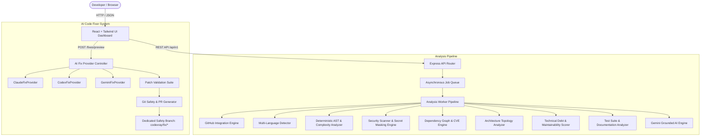

# CodeX-Ray

> **AI-Powered GitHub Repository Intelligence Platform**  
> *"Understand your codebase beyond the surface."*

CodeX-Ray is a portfolio-grade developer intelligence platform that provides deep technical analysis of software codebases. It combines **deterministic AST analysis**, **cyclomatic complexity profiling**, **secret scanning with zero-leakage masking**, **architecture topology mapping**, and **grounded AI reasoning** via Google Gemini, Anthropic Claude, and OpenAI Codex.

---

## 🏛️ System Architecture



---

## 🚀 Key Features

### 1. Deterministic Static Code Analysis
- **Cyclomatic Complexity Profiler**: Calculates decision branch complexity ($M = E - N + 2P$) across Python, TypeScript, JavaScript, Go, Rust, Java, C#, and more.
- **Code Smell Engine**: Detects arrow anti-patterns, deeply nested control flows ($\ge 5$ levels), and silent exception suppressions (`except: pass`, empty `catch {}`).

### 2. Zero-Leakage Security & Secret Scanner
- **Secret Masking**: Identifies GitHub PATs, AWS keys, JWT secrets, database connection strings with passwords, and private keys. All secrets are masked immediately (`ghp_********************7H2K`) and are **never** exposed in browser memory or sent to LLMs.
- **Vulnerability Sinks**: Pinpoints SQL injection patterns, command injection sinks (`shell=True`), insecure wildcard CORS policies, and unsafe deserialization (`pickle.loads`, `yaml.load`).
- **Confidence Ratings**: Every finding includes a deterministic confidence level (`HIGH`, `MEDIUM`, `LOW`) and empirical line references.

### 3. Architecture Topology & Dependency Graph
- Identifies presentation components, API controllers, domain logic, persistence models, test suites, and build infrastructure.
- Visualizes layer cohesion ratings and inter-module dependencies.
- Parses dependency manifests (`package.json`, `requirements.txt`, `Cargo.toml`, `go.mod`) with known CVE advisory matching.

### 4. Grounded AI Reasoning & Pull Request Review Agent
- Uses Google's `@google/genai` TypeScript SDK on the server with `gemini-3.8-flash`.
- Strictly adheres to the **Anti-Hallucination Contract**: AI receives only deterministic scan data and never invents files, lines, or vulnerabilities.
- **PR Review Agent**: Analyzes pull request diffs, detects regressions, and outputs categorized review comments (`BUG`, `SECURITY`, `PERFORMANCE`, `ARCHITECTURE`, `STYLE`, `TESTING`, `DOCUMENTATION`).

---

## 🛠️ AI Code Fixer (Optional Auto-Fix System)

CodeX-Ray is **READ-ONLY by default**. Automated code changes are never applied silently. When a developer explicitly clicks **[ Fix with AI ]**:

```
Finding Detected
       ↓
Click [ Fix with AI ]
       ↓
Choose Provider: [ Claude ] / [ Codex ] / [ Gemini ]
       ↓
Minimal Context Sent (Affected file, lines, evidence, imports only)
       ↓
AI Proposes Structured Unified Diff Patch
       ↓
CodeX-Ray Validation Suite
  ├─ Verify target file exists
  ├─ Verify original code matches
  ├─ Verify patch applies cleanly
  ├─ Reject unexpected file modifications
  ├─ Re-run Static AST Analysis
  ├─ Re-run Security Scanner
  └─ Compare Before vs After Findings Delta
       ↓
User Reviews in Professional Diff Viewer
       ↓
User Explicitly Approves
       ↓
Commit to Isolated Branch: codexray/fix/<finding-id>
       ↓
Generate Pull Request with Full Audit Trail
```

### Git Safety Invariants
1. **Protected Branch Protection**: `main`, `master`, and `production` branches are **never** modified directly.
2. **Dedicated Branch**: Changes are committed exclusively to isolated branches (`codexray/fix/<id>`).
3. **Never Auto-Merged**: CodeX-Ray will never automatically merge pull requests. Explicit developer review is mandatory.

---

## 📡 REST API Reference

| Method | Endpoint | Description |
|---|---|---|
| `POST` | `/api/v1/analysis` | Enqueues an asynchronous repository analysis job |
| `GET` | `/api/v1/analysis/:id/status` | Returns real-time job progress and completed stages |
| `GET` | `/api/v1/analysis/:id/report` | Returns the complete engineering report |
| `GET` | `/api/v1/repositories` | Lists curated and benchmark codebases |
| `GET` | `/api/v1/repositories/:owner/:repo/files` | Retrieves source file content for file explorer |
| `GET` | `/api/v1/repositories/:owner/:repo/pulls` | Fetches open pull requests |
| `POST` | `/api/v1/repositories/:owner/:repo/pulls/:pr/review` | Executes PR AI Code Review Agent |
| `GET` | `/api/v1/fixes/providers` | Reports configured external AI providers (without key leakage) |
| `POST` | `/api/v1/fixes/preview` | Generates a unified diff patch proposal using minimal context |
| `POST` | `/api/v1/fixes/validate` | Executes 7-step patch validation suite |
| `POST` | `/api/v1/fixes/apply` | Commits validated patch to safety branch `codexray/fix/*` |
| `POST` | `/api/v1/fixes/create-pr` | Creates audited Pull Request |

---

## 💻 Local Setup & Execution

### Prerequisites
- Node.js 20+
- npm 10+
- (Optional) Docker & Docker Compose

### 1. Installation
```bash
git clone https://github.com/your-username/codex-ray.git
cd codex-ray
npm install
```

### 2. Environment Variables
Create a `.env` file based on `.env.example`:
```bash
cp .env.example .env
```
Configure your keys:
```env
# Server-side Gemini AI API key
GEMINI_API_KEY="your-gemini-key"

# (Optional) External Coding AI Providers for AI Fixer
ANTHROPIC_API_KEY="your-anthropic-key"
OPENAI_API_KEY="your-openai-key"

# (Optional) GitHub Token for private repos and increased rate limits
GITHUB_TOKEN="ghp_your_personal_access_token"
```

### 3. Run Development Server
```bash
npm run dev
```
Open [http://localhost:3000](http://localhost:3000) in your browser.

### 4. Build and Run Full-Stack Production Server
```bash
npm run build
npm start
```

### 5. Run with Docker Compose
```bash
docker compose up --build
```

---

## 🔒 Security Architecture
- **Zero API Key Leakage**: Provider keys (`ANTHROPIC_API_KEY`, `OPENAI_API_KEY`, `GEMINI_API_KEY`, `GITHUB_TOKEN`) are strictly scoped to server memory. No secrets are ever sent to client bundles or logged.
- **Isolated Sandboxing**: Code analysis operates on in-memory representations; execution of scanned user code is prohibited.
- **Anti-Hallucination Contract**: Every finding and recommendation must be backed by deterministic AST evidence and file line references.
